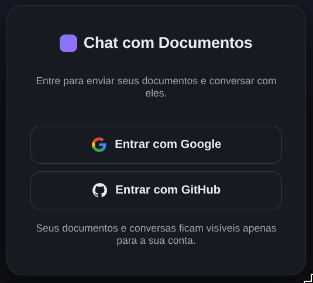
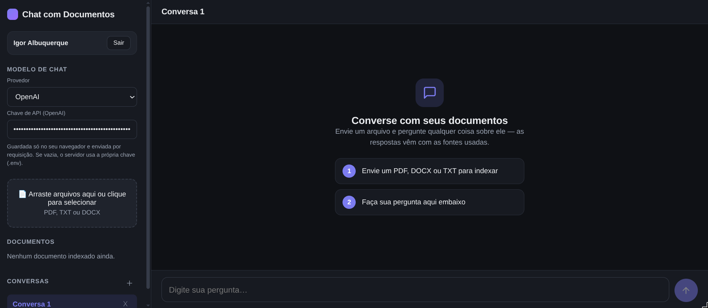

# 💬 Chat with Documents via AI: RAG with semantic search on Redis

**🌐 Language:** **English** · [Português (BR)](README.pt-BR.md)

> Upload your documents (**PDF / TXT / DOCX**) and **talk to them**. The app finds
> the most relevant passages with **semantic vector search on Redis** and an LLM
> writes the answer **citing the exact sources** it used. That's
> **RAG (Retrieval-Augmented Generation)**.

**🚀 Live demo:** <https://chat-rag-web.onrender.com>

> ⚠️ **The production demo runs entirely on free tiers** (Render free for the
> app + Redis Cloud free for the vector store), so it has real limitations and
> is meant to **showcase functionality, not production performance**:
>
> - **Cold start:** after inactivity the services sleep — the **first** request
>   may take ~30–60s to wake them up. After that it's responsive.
> - **Performance:** limited CPU/RAM, so uploading large documents and indexing
>   many chunks is noticeably slower than a local run, and concurrent usage is
>   constrained.
> - **Storage:** the Redis Cloud free tier caps storage (~30 MB), so only a
>   limited number/size of documents fit, and data may be evicted or reset.
>
> For full performance, run it locally (see [Quickstart](#-quickstart-tldr)) or
> deploy on a paid tier.

---

## 📑 Table of contents

1. [Screenshots](#-screenshots)
2. [Quickstart (TL;DR)](#-quickstart-tldr) (running in 3 commands)
3. [What you can do](#-what-you-can-do)
4. [Architecture](#-architecture)
5. [Run locally, step by step](#-run-locally-step-by-step)
6. [Using the application](#-using-the-application)
7. [Verify it works (terminal)](#-verify-it-works-terminal)
8. [Environment variables](#-environment-variables)
9. [API endpoints](#-api-endpoints)
10. [RAG pipeline (LangGraph)](#-rag-pipeline-langgraph)
11. [Tests](#-tests)
12. [Architecture decisions & trade-offs](#-architecture-decisions--trade-offs)
13. [Troubleshooting](#-troubleshooting)
14. [Project structure](#-project-structure)
15. [Differentials & requirements coverage](#-differentials--requirements-coverage)

---

## 📸 Screenshots

**Login**



> The login screen only appears in the **production** deployment
> (<https://chat-rag-web.onrender.com>), where authentication is enabled so each
> user only sees **their own** documents and conversations. Running locally with
> `docker compose up`, authentication is **off by default**, so you go straight to
> the main screen, no login required.

**Main screen**



---

## ⚡ Quickstart (TL;DR)

You only need **Docker**. Nothing else: no Python, Node or Redis on your machine.

```bash
git clone <repository-url> && cd chat_rag   # 1. get the code
cp .env.example .env                         # 2. create your config (works as-is for local LLM)
docker compose up --build                    # 3. build & run everything
```

Then open **<http://localhost:3000>** 🎉

> 💡 The default config runs **100% local and free** via [Ollama](https://ollama.com)
> (you'll need Ollama running on your machine, see [Path B](#path-b-100-local-and-free-ollama)).
> Prefer the simplest path? Just paste an API key into `.env`, see
> [Path A](#path-a-with-an-api-key-simplest--fastest-).

The whole stack comes up with **a single command**, exactly as the challenge
requires (`docker compose up --build`).

---

## ✨ What you can do

- 📤 **Upload** PDF, TXT or DOCX (drag-and-drop or file picker, multiple files at once).
- 🔎 The text is **chunked, embedded and indexed** for semantic search in Redis.
- 💬 **Ask questions** and get answers **streamed token-by-token**, each one
  showing the **sources** it was based on.
- 🗂️ Manage **multiple chat sessions** (create, rename, delete).
- 🧹 **Delete a document** and its vectors are removed from Redis.
- 🔌 **Swap LLM/embeddings provider** (OpenAI, Anthropic, Gemini, Ollama) with one
  env var, or let each visitor **bring their own key** from the UI.

---

## 🏗️ Architecture

```
┌──────────────┐       ┌──────────────────────┐      ┌──────────────────┐
│  Frontend    │ HTTP  │   API (FastAPI)      │      │  Redis Stack     │
│  React + Vite│─────▶ │   /upload /chat ...  │─────▶│  RediSearch      │
│  (Nginx)     │ SSE   │   LangGraph RAG      │◀─────│  (HNSW / COSINE) │
└──────────────┘       └──────────┬───────────┘      └──────────────────┘
                                  │
                                  ▼
                  LLM         (OpenAI / Anthropic / Gemini / Ollama)
                  Embeddings  (OpenAI / Gemini / Sentence-Transformers)
```

| Layer        | Technology                                          |
|--------------|-----------------------------------------------------|
| Frontend     | React 18 + TypeScript + Vite, served via Nginx      |
| API          | Python 3.11, FastAPI, LangChain + LangGraph         |
| Vector Store | Redis Stack (RediSearch, HNSW / COSINE index)       |
| LLM          | OpenAI / Anthropic / Gemini / Ollama (configurable) |
| Embeddings   | OpenAI / Gemini / Sentence-Transformers (config.)   |
| Infra        | Docker Compose                                      |

---

## 🛠️ Run locally, step by step

This section is intentionally **foolproof**: follow it top to bottom and it will
just work. The only thing you install is **Docker**.

### Prerequisites

| Requirement                | Minimum version | How to check             |
|----------------------------|-----------------|--------------------------|
| Docker                     | 20.10+          | `docker --version`       |
| Docker Compose             | v2 (plugin)     | `docker compose version` |
| (optional) Ollama on host  | 0.1+            | `ollama --version`       |

> **`docker compose` vs `docker-compose`:** modern Docker uses
> `docker compose` (a space). If you're on the old v1, use `docker-compose`
> (a hyphen) instead; both run the same thing.

### Step 1: Clone the repository

```bash
git clone <repository-url>
cd chat_rag
```

### Step 2: Create your `.env`

```bash
cp .env.example .env
```

This file holds your settings and keys. **It is git-ignored**, so your keys never
get committed.

### Step 3: Pick a provider (choose ONE path)

The app is **provider-agnostic**: you decide who generates embeddings and
answers, just by editing `.env`.

#### Path A: With an API key (simplest & fastest) ⭐

Nothing to install beyond Docker. Paste your key and you're done.

<details open>
<summary><b>OpenAI</b></summary>

```env
LLM_PROVIDER=openai
EMBEDDING_PROVIDER=openai
LLM_MODEL=gpt-4o-mini
EMBEDDING_MODEL=text-embedding-3-small
OPENAI_API_KEY=sk-...          # 👈 your key here
```
</details>

<details>
<summary><b>Anthropic (Claude) + free local embeddings</b></summary>

```env
LLM_PROVIDER=anthropic
EMBEDDING_PROVIDER=sentence-transformers
LLM_MODEL=claude-3-5-sonnet-latest
EMBEDDING_MODEL=all-MiniLM-L6-v2
ANTHROPIC_API_KEY=sk-ant-...   # 👈 your key here
INSTALL_LOCAL_EMBEDDINGS=true  # embeddings run locally → enable the heavy extra
```
</details>

<details>
<summary><b>Google Gemini (has a free tier: LLM + embeddings)</b></summary>

```env
LLM_PROVIDER=gemini
EMBEDDING_PROVIDER=gemini
LLM_MODEL=gemini-1.5-flash
EMBEDDING_MODEL=models/text-embedding-004
GOOGLE_API_KEY=...             # 👈 your key here
```
</details>

#### Path B: 100% local and free (Ollama)

No paid API. **Embeddings** run inside the container (Sentence-Transformers,
downloaded on first use). The **LLM** runs via [Ollama](https://ollama.com) on
your host machine:

```bash
# 1. Install Ollama (https://ollama.com/download), then pull a model:
ollama pull llama3

# 2. Make sure Ollama is running (it usually starts on its own):
ollama serve        # only if it isn't already active
```

`.env`:
```env
LLM_PROVIDER=ollama
EMBEDDING_PROVIDER=sentence-transformers
LLM_MODEL=llama3
EMBEDDING_MODEL=all-MiniLM-L6-v2
OLLAMA_BASE_URL=http://host.docker.internal:11434
INSTALL_LOCAL_EMBEDDINGS=true   # installs sentence-transformers + torch (bigger image)
```

> The default image is **slim** (API-provider stack only). Local embeddings
> (Sentence-Transformers + torch) are a heavy opt-in enabled by
> `INSTALL_LOCAL_EMBEDDINGS=true`, so they're only installed when you need them.
> `docker-compose.yml` already maps `host.docker.internal` on Linux, so the
> `api` container can reach the Ollama on your machine.

### Step 4: Start everything

```bash
docker compose up --build
```

First run pulls images and installs dependencies (a few minutes). When ready
you'll see logs from all **3 services** (`redis`, `api`, `frontend`). Add `-d`
to run in the background: `docker compose up --build -d`.

### Step 5: Open it

| What                            | URL                            |
|---------------------------------|--------------------------------|
| **Application (Frontend)**      | <http://localhost:3000>        |
| API docs (Swagger)             | <http://localhost:8000/docs>   |
| API health check               | <http://localhost:8000/health> |
| RedisInsight (inspect Redis)    | <http://localhost:8001>        |

### Step 6: Stop / reset

```bash
docker compose down       # stop services (keeps Redis data)
docker compose down -v    # stop AND delete the Redis volume (full reset)
```

> ⚠️ **Changing the embeddings model?** Run `docker compose down -v` first. The
> vector index dimension comes from the model (1536 for OpenAI, 384 for
> `all-MiniLM-L6-v2`); an index built with a different dimension is incompatible.

---

## 🖱️ Using the application

1. Open <http://localhost:3000>.
2. **Chat model (optional):** in the sidebar, choose the LLM provider and paste
   its key. Skip this if the server already has a key in `.env`, or if you use a
   keyless local provider (Ollama).
3. **Upload:** drag a PDF / TXT / DOCX onto the upload area (or click to pick).
   Watch the progress (upload → processing). You can **Cancel** mid-upload,
   handy for large files.
4. The file shows up in the **Documents** list with its number of indexed chunks.
5. **Ask** in the chat box and hit **Enter**. The answer **streams** in
   token-by-token.
6. Click **Sources** under any answer to see the exact chunks used.
7. **Multiple conversations:** create / rename / delete sessions in the sidebar
   (double-click a name to rename).
8. Remove a document with the **✕** in the list, and its vectors are deleted from
   Redis.

---

## ✅ Verify it works (terminal)

Confirm the whole flow end-to-end without opening a browser:

```bash
# 1. Health check (expects redis: "connected")
curl http://localhost:8000/health
# {"status":"ok","redis":"connected"}

# 2. Upload a sample document
echo "Third-quarter profit grew 20% compared to Q2." > sample.txt
curl -F "files=@sample.txt" http://localhost:8000/upload
# {"files":[{"file_id":"...","name":"sample.txt","chunks_indexed":1,...}],...}

# 3. List indexed documents
curl http://localhost:8000/documents

# 4. Ask a question (RAG)
curl -X POST http://localhost:8000/chat \
  -H "Content-Type: application/json" \
  -d '{"question":"What was the Q3 result?","session_id":"demo"}'
# {"answer":"...","sources":[{"chunk":"...","source":"sample.txt","score":0.9}],"session_id":"demo"}

# 5. Streaming answer (Server-Sent Events)
curl -N -X POST http://localhost:8000/chat/stream \
  -H "Content-Type: application/json" \
  -d '{"question":"Summarize the document","session_id":"demo"}'
```

---

## ⚙️ Environment variables

Full reference: every variable, what it does, and its default. You usually only
touch the provider ones from [Step 3](#step-3--pick-a-provider-choose-one-path).

| Variable                                | Description                                       | Default                              |
|-----------------------------------------|---------------------------------------------------|--------------------------------------|
| `LLM_PROVIDER`                          | `openai` / `anthropic` / `gemini` / `ollama`      | `ollama`                             |
| `EMBEDDING_PROVIDER`                    | `openai` / `gemini` / `sentence-transformers`     | `sentence-transformers`              |
| `LLM_MODEL`                             | chat model name                                   | `llama3`                             |
| `EMBEDDING_MODEL`                       | embeddings model name                             | `all-MiniLM-L6-v2`                   |
| `OPENAI_API_KEY`                        | OpenAI key (if applicable)                        | —                                    |
| `ANTHROPIC_API_KEY`                     | Anthropic key (if applicable)                     | —                                    |
| `GOOGLE_API_KEY`                        | Google Gemini key (if applicable)                 | —                                    |
| `OLLAMA_BASE_URL`                       | Ollama endpoint                                   | `http://host.docker.internal:11434`  |
| `REDIS_URL`                             | Redis URL (set automatically in compose)          | `redis://localhost:6379`             |
| `CHUNK_SIZE`                            | chunk size (tokens)                               | `500`                                |
| `CHUNK_OVERLAP`                         | overlap between chunks (tokens)                   | `50`                                 |
| `TOP_K`                                 | chunks retrieved per question                     | `5`                                  |
| `EF_RUNTIME`                            | HNSW search breadth (higher = better recall)      | `128`                                |
| `HISTORY_SIZE`                          | messages kept per session                         | `6`                                  |
| `INSTALL_LOCAL_EMBEDDINGS`              | build flag: install Sentence-Transformers + torch | `false`                             |
| `INSTALL_OCR`                           | build flag: install OCR stack for scanned PDFs    | `false`                              |
| `OCR_LANGUAGE`                          | Tesseract languages (`+`-separated)               | `por+eng`                            |
| `OCR_DPI`                               | render DPI used for OCR                            | `200`                                |
| `AUTH_ENABLED`                          | require Google/GitHub login (production)          | `false`                              |
| `BACKEND_URL`                           | public backend URL (for OAuth redirect URIs)      | —                                    |
| `FRONTEND_URL`                          | where to return after login                       | `/`                                  |
| `SESSION_SECRET`                        | signs the login token (change in production)      | `dev-insecure-…`                     |
| `GOOGLE_OAUTH_CLIENT_ID` / `..._SECRET` | Google OAuth app credentials                      | —                                    |
| `GITHUB_OAUTH_CLIENT_ID` / `..._SECRET` | GitHub OAuth app credentials                      | —                                    |

### 🔑 Bring-your-own-key (per-request LLM)

The sidebar lets each visitor **pick the chat LLM provider** (from the server's
`supported_llm_providers`, see `/config`) and **paste that provider's key**. It's
sent per request as `X-LLM-Provider` / `X-API-Key`, overriding the server config
for that request only (the key lives only in the browser). Keys can also come
from the server `.env` as a fallback. This means a public deploy needs **no
shipped key**: each visitor brings their own.

> **Embeddings stay fixed on the server** (provider + model). Only the **chat
> LLM** is per-request, because the Redis vector index dimension is set by the
> embedding model and must stay consistent across all documents and queries.

### 🔒 Authentication / login (optional)

Login is **off by default**: local runs need no accounts. For a **public
deployment**, set `AUTH_ENABLED=true` and visitors must sign in with **Google or
GitHub**; each user then sees only **their own** documents and conversations
(data is tagged per user).

How it works: the OAuth handshake happens on the backend (Authlib); on success
the backend issues a **signed token** and redirects back to the UI, which sends
it as `Authorization: Bearer` on every request. The API stays stateless (no
cross-site cookies).

<details>
<summary><b>Enabling it in production</b></summary>

1. **Create the OAuth apps** and register the callback URLs:
   - Google: [Cloud Console → Credentials](https://console.cloud.google.com/apis/credentials)
     → *OAuth client ID* (type *Web*). Redirect URI:
     `<BACKEND_URL>/auth/callback/google`
   - GitHub: [Settings → Developer settings → OAuth Apps](https://github.com/settings/developers)
     → *New OAuth App*. Callback URL: `<BACKEND_URL>/auth/callback/github`
2. Set `AUTH_ENABLED=true`, `BACKEND_URL`, `FRONTEND_URL`, a strong
   `SESSION_SECRET`, and the four `*_OAUTH_*` values.
3. Redeploy. The UI now shows the login screen until the user signs in.

</details>

### 📄 Scanned PDFs (OCR)

PDFs **with a text layer** and TXT work out of the box. **Scanned / image-only
PDFs** have no extractable text, so ingestion needs OCR, an opt-in build extra
(keeps the default image small):

```env
# .env
INSTALL_OCR=true
```
```bash
docker compose up --build   # rebuilds the API image with Tesseract + PyMuPDF
```

Without it, uploading a scanned PDF returns a **clear error** instead of indexing
an empty document. OCR is **slow** on big files (it renders and reads every page).

---

## 🌐 API endpoints

| Method | Route               | Description                                        |
|--------|---------------------|---------------------------------------------------|
| POST   | `/upload`           | Receives file(s) and triggers ingestion           |
| GET    | `/documents`        | Lists indexed documents                           |
| DELETE | `/documents/{id}`   | Removes a document and its vectors                |
| POST   | `/chat`             | Question + RAG answer with sources                |
| POST   | `/chat/stream`      | Same as `/chat`, with SSE streaming               |
| GET    | `/health`           | Health check (status + Redis connectivity)        |
| GET    | `/config`           | Configured providers + whether an API key is needed |

Example `POST /chat`:
```json
{ "question": "What were the main Q3 results?", "session_id": "abc-123", "top_k": 5 }
```
```json
{
  "answer": "The main Q3 results were...",
  "sources": [{ "chunk": "...", "source": "report_q3.pdf", "score": 0.91 }],
  "session_id": "abc-123"
}
```

Interactive docs (Swagger UI): <http://localhost:8000/docs>.

---

## 🧠 RAG pipeline (LangGraph)

The flow is orchestrated by a **LangGraph** graph
(`backend/app/services/rag_graph.py`) with four nodes, instead of a simple
chain, which makes the flow explicit and easy to extend (validation, retry,
conditional branching):

```
retriever_node → context_builder_node → llm_node → response_formatter_node
```

1. **retriever_node**: embeds the question and runs a **KNN search** on Redis.
2. **context_builder_node**: builds the prompt from the retrieved context **plus
   the session history**.
3. **llm_node**: calls the configured LLM with the assembled prompt.
4. **response_formatter_node**: formats the final answer, **including sources**.

Streaming (`/chat/stream`) reuses the retrieval/context nodes and streams the LLM
tokens over SSE.

---

## 🧪 Tests

### Backend (pytest)

Built with `pytest`, mocking Redis (`fakeredis`), embeddings and the LLM, so
**no real API calls** are made. **Coverage: 100%** of the backend (`pytest`
fails automatically if it drops below the 95% threshold).

**Option 1: via Docker (no Python install):**
```bash
make test
```

**Option 2: locally (requires Python 3.11+):**
```bash
cd backend
python -m venv .venv && source .venv/bin/activate
pip install -r requirements.txt
pytest                 # or, from the repo root: make test-local
```

> Integration tests that need a **real Redis Stack** are opt-in: `pytest -m integration`.

The pytest config (`--cov` + the 95% threshold) lives in `backend/pyproject.toml`.

```
backend/tests/
├── conftest.py                   # fixtures: redis/llm/embeddings mocks, TestClient
├── test_ingestion.py             # chunking, PDF/TXT/DOCX extraction, OCR fallback
├── test_api_upload.py            # POST /upload
├── test_api_chat.py              # POST /chat and /chat/stream (RAG, BYOK headers)
├── test_api_documents.py         # GET and DELETE /documents
├── test_factories.py             # LLM/embedding provider factories (all providers)
├── test_redis_client.py          # connection, ping, index creation
├── test_retriever.py             # KNN result parsing
├── test_main.py                  # lifespan, /health, /config
├── test_auth.py                  # OAuth login, tokens, user isolation gate
├── test_misc.py                  # config, history, small edge cases
└── test_retriever_integration.py # real Redis Stack (opt-in, `-m integration`)
```

### Frontend (Vitest + Testing Library)

The frontend is **TypeScript** (strict mode) and covered by a **Vitest** suite
using React Testing Library, mocking the API layer (`fetch` / `axios`), with no real
network. **38 tests, ~88% coverage** (a threshold gate fails the run if it drops).

```bash
cd frontend
npm install
npm run typecheck      # tsc --noEmit (strict)
npm test               # vitest run
npm run test:coverage  # with coverage + threshold gate
```

Or, with no local Node, from the repo root: `make test-frontend`.

```
frontend/src/
├── api/client.test.ts            # token helpers, SSE streaming parser, 401 handling
├── api/client.axios.test.ts      # upload / documents / chat / config HTTP calls
├── App.test.tsx                  # auth gating (login screen vs main UI)
├── components/ChatWindow.test.tsx     # send on Enter, streamed answer, errors
├── components/FileUpload.test.tsx     # type filter, upload, empty-extraction error
├── components/ApiKeyInput.test.tsx    # provider switch + key persistence
├── components/SessionSidebar.test.tsx # create / select / rename / delete
├── components/DocumentList.test.tsx   # list + remove
├── components/SourcesPanel.test.tsx   # collapse / expand
├── components/MessageBubble.test.tsx  # user vs assistant, pending, sources
└── test/setup.ts                 # jest-dom matchers, jsdom polyfills
```

---

## 🧭 Architecture decisions & trade-offs

- **Configurable provider (OpenAI/Anthropic/Gemini/Ollama):** factories in
  `llm.py` and `embeddings.py` decouple the rest of the code from the vendor.
  Run 100% local & free (Ollama) or with paid/free APIs by switching one env
  var, and visitors can override the chat LLM per request (BYOK).
- **LangGraph instead of a simple chain:** more control and extensibility of the
  RAG flow (room for future validation/retry/branching nodes).
- **HNSW + COSINE index:** good speed/quality balance for semantic similarity;
  the dimension is derived from the embeddings model.
- **Chunk as a Redis HASH** (`doc:{file_id}:chunk:{n}`): metadata (source,
  chunk_index, uploaded_at) sits next to the vector, simplifying listing and
  deletion by `file_id`.
- **Per-session history in Redis** (a list capped by `HISTORY_SIZE`): short-term
  context with no dependency on in-memory API state.
- **Streaming via SSE** with `fetch` on the frontend (POST) and
  `proxy_buffering off` in Nginx for true token-by-token delivery.
- **Optional auth via one code path:** every operation is scoped to a `user_id`
  (a fixed public id when login is off, the OAuth identity when on). The same
  ingestion/retrieval/history code runs in both modes; the retriever just adds a
  `@user_id` pre-filter to the KNN query. Token-based (no cross-site cookies), so
  the API stays stateless across split frontend/backend domains.

---

## 🩺 Troubleshooting

| Symptom                                   | Likely cause / fix                                                                       |
|-------------------------------------------|------------------------------------------------------------------------------------------|
| `/health` shows `redis: "disconnected"`   | `redis` is still starting; wait for the healthcheck or run `docker compose logs redis`.  |
| Dimension error on upload/chat            | You changed the embeddings model without resetting the index → `docker compose down -v`, then up. |
| Chat fails with `LLM_PROVIDER=ollama`     | Ollama isn't running or the model wasn't pulled (`ollama pull llama3`). Check `OLLAMA_BASE_URL`. |
| Provider auth error (500)                 | The API key (in `.env` or the sidebar) is missing/invalid for the selected provider.      |
| "No text extracted" on a PDF              | The PDF is scanned/image-only → enable OCR (`INSTALL_OCR=true`) and rebuild.               |
| Upload returns 413 (too large)            | File exceeds the Nginx limit (`client_max_body_size`, default 300M in `frontend/nginx.conf`). |
| Port 3000 / 8000 / 6379 already in use    | Stop the conflicting process or change the port mapping in `docker-compose.yml`.          |

Useful logs:
```bash
docker compose logs -f api    # API logs only
docker compose logs -f        # all services
```

---

## 🗂️ Project structure

```
chat_rag/
├── backend/                    # FastAPI + LangGraph + RAG services + tests
│   ├── app/
│   │   ├── main.py             # FastAPI app, CORS, lifespan
│   │   ├── routers/            # upload, chat, documents, auth endpoints
│   │   ├── services/           # ingestion, retriever, rag_graph, llm, embeddings, …
│   │   ├── models/schemas.py   # Pydantic request/response models
│   │   └── config.py           # settings via env vars
│   ├── tests/                  # pytest suite (100% coverage)
│   ├── Dockerfile
│   └── requirements.txt
├── frontend/                   # React + TypeScript + Vite (Nginx in production)
│   ├── src/components/         # *.tsx: ChatWindow, FileUpload, DocumentList, …
│   ├── src/**/*.test.{ts,tsx}  # Vitest + Testing Library suite
│   ├── tsconfig.json
│   ├── Dockerfile
│   └── package.json
├── .github/workflows/ci.yml    # CI: pytest + integration + frontend build
├── docker-compose.yml          # redis + api + frontend (one command up)
├── render.yaml + DEPLOY.md     # cloud deploy (Render)
├── .env.example
├── Makefile
├── README.md                   # English (this file)
└── README.pt-BR.md             # Portuguese
```

---

## 🏅 Differentials & requirements coverage

**Everything the challenge asks for, and where to find it.**

| Challenge requirement                                   | Status | Where |
|---------------------------------------------------------|:------:|-------|
| Ingestion of **PDF & TXT** (+ chunking with overlap)    | ✅ | `services/ingestion.py`, `CHUNK_SIZE`/`CHUNK_OVERLAP` |
| Embeddings (OpenAI **or** Sentence-Transformers)        | ✅ | `services/embeddings.py` |
| Vectors in **Redis Stack / RediSearch** (HNSW, COSINE)  | ✅ | `services/redis_client.py`, `retriever.py` |
| Endpoints `/upload`, `/documents`, `DELETE`, `/chat`, `/health` | ✅ | [API endpoints](#-api-endpoints) |
| **RAG** flow with **LangChain/LangGraph**               | ✅ | [RAG pipeline](#-rag-pipeline-langgraph) |
| Per-session **conversation history**                    | ✅ | `services/history.py`, `HISTORY_SIZE` |
| `sources` returned with each answer                     | ✅ | `POST /chat` response |
| **React** chat UI (upload, progress, docs, sources, Enter, loading) | ✅ | `frontend/src/` |
| **Docker Compose** (api + frontend + redis, volumes, healthchecks) | ✅ | `docker-compose.yml` |
| Runs with **one command** `docker compose up --build`   | ✅ | [Quickstart](#-quickstart-tldr) |
| **Unit tests** with mocks (≥60% coverage required)      | ✅ | **100%** coverage ([Tests](#-tests)) |
| README: setup, env vars, decisions, how to test         | ✅ | this file |

**Extra differentials implemented (bonus):**

- ✅ **Response streaming** (Server-Sent Events).
- ✅ **RAG pipeline with LangGraph** (instead of a simple chain).
- ✅ **Multiple chat sessions** with custom names.
- ✅ **CI with GitHub Actions** (tests + build on every push).
- ✅ **Cloud deploy** with a working link (Render).
- ✅ **Multi-file upload** + **DOCX support** (beyond the required PDF/TXT).
- ✅ **OCR for scanned PDFs** (opt-in build, Tesseract).
- ✅ **Document removal** with vector cleanup in Redis.
- ✅ **Bring-your-own-key** + per-request LLM provider chosen in the UI.
- ✅ **Google Gemini** provider (LLM + embeddings), incl. a free-tier path.
- ✅ **Cancelable uploads** and **100%** backend test coverage.
- ✅ **Optional Google/GitHub login** with per-user data isolation.
- ✅ **TypeScript frontend** (strict) with a **Vitest + Testing Library** suite
  (38 tests, ~88% coverage) wired into CI.

---

<p align="center"><sub>Built by <a href="https://www.linkedin.com/in/igorcezaralbuquerque"><strong>Igor Albuquerque</strong></a></sub></p>
